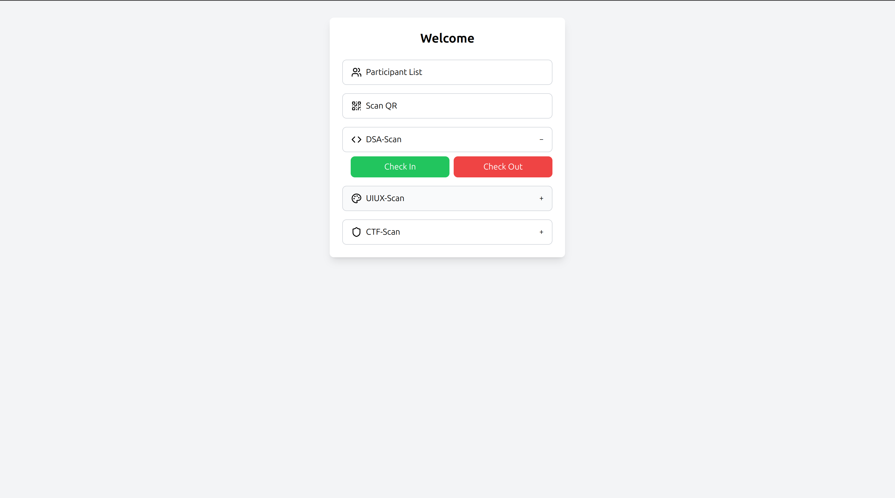
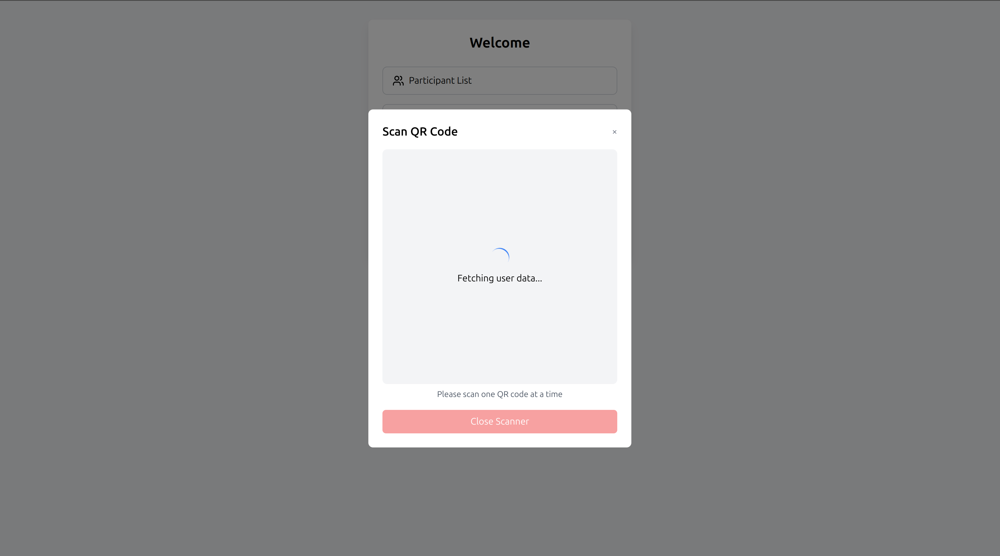
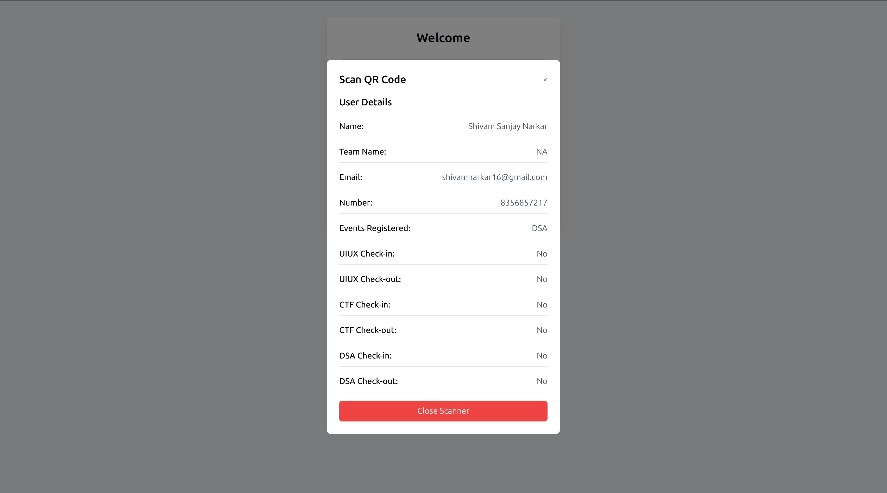
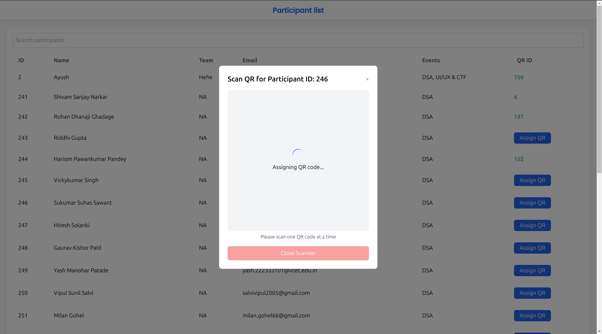
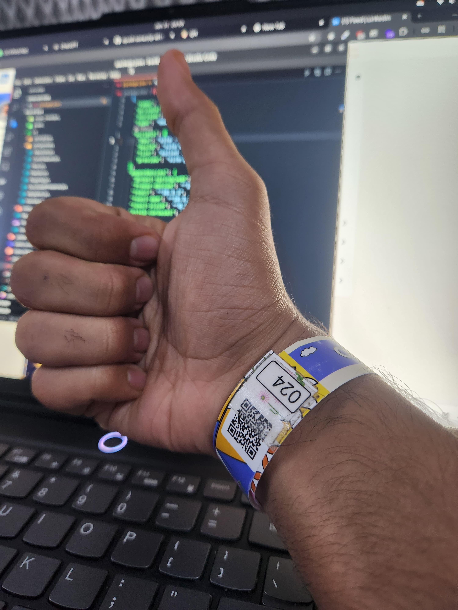

# QR Attendance System for CodeCraft 2025

This project is a QR-based attendance management system developed for **CodeCraft 2025**, organized by the **CSI Committee**. The system efficiently handles participant check-ins and check-outs for multiple events using dynamically assigned QR bands.

This system was used during the event to manage participant attendance and event participation.
It worked seamlessly, providing real-time updates and participant tracking. The system was well-received by the event organizers and participants.

---

## Features

### 1. Dynamic QR Assignment
- **Random QR Generation**: Unique QR codes are generated.
- **On-Demand Assignment**: QRs can be assigned to participants during distribution by searching for the participant and clicking the "Assign QR" button next to their name, followed by scanning any unassigned QR.

### 2. Event Management
- Supports check-in and check-out tracking for three events:
  - **DSA** (Data Structures and Algorithms)
  - **UI/UX**
  - **CTF** (Capture The Flag)
- Individual event statuses (check-in/check-out) are displayed for each participant.

### 3. Participant Management
- A central dashboard to:
  - View the list of participants.
  - Search participants by name or email.
  - Manage participant details, including event registrations.

### 4. QR Scanning
- QR scanning functionality allows:
  - Fetching participant details.
  - Viewing real-time check-in and check-out status.

### 5. Real-Time Updates
- All actions, including QR assignment and event check-ins, are reflected instantly in the system.

---

## Screenshots

### Welcome Screen
The main interface to access event-specific check-in/check-out options, QR scanning, and participant list management.

### QR Scanning Modal
Displays participant information upon scanning a QR code.

### Assign QR
Assign a QR code to a participant by searching for their name and clicking the "Assign QR" button.

### Bands

---

